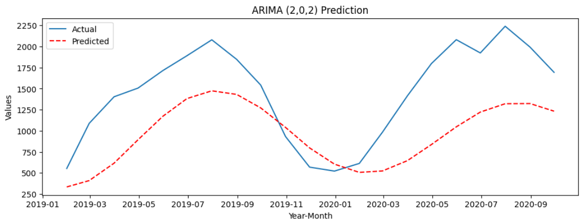

# ARIMA Solar Energy

This project was a bit of an educational project for me to undesrtand how to build and evaluate ARIMA models.
 
The ARIMA model was used to predict the amount of solar energy generated.

## Important Concepts

**Stationary**: A time-series data having the mean and variance as a constant is called a stationary time series. Removing trends or seasonality. If the time series is trending upwards, differencing will help remove that trend.

**Autocorrelation**: Autocorrelation is a statistical concept that measures the correlation of a signal with a delayed copy of itself over varying time intervals. In simpler terms, it assesses how the values of a time series are related to their own past values.
  
**Lag**: Autocorrelation is calculated at different "lags," which refer to the time intervals between observations. For example, a lag of 1 would compare a value to the value immediately preceding it, while a lag of 2 would compare a value to the value two time periods earlier.
  
**Durbin-Watson**: The Durbin-Watson statistic is a test used to detect the presence of autocorrelation in the residuals from a regression analysis. It specifically tests for first-order autocorrelation, which means it checks if residuals are correlated with their immediate predecessors. The value of the Durbin-Watson statistic ranges from 0 to 4, where:

- value of 2 indicates no autocorrelation.
- Values below 2 suggest positive autocorrelation.
- Values above 2 suggest negative autocorrelation.

## ARIMA

Autoregressive Integrated Moving Average (ARIMA), is one of the key and popular time-series models.

- _Autoregressive Model (AM)_: As the name indicates, it is a regression of the variable
  against itself , that is, the linear combination of past values of the variables are used to
  forecast the future value.

- _Moving average (MA)_: Instead of past values, a past forecast’s errors are used to build
  a model.

Example:
Suppose you're predicting daily sales for a store, and you have the following sales data (in units):

| Day | Actual Sales | Forecast (F) | Error (E = Actual - Forecast) |
| --- | ------------ | ------------ | ----------------------------- |
| 1   | 100          | 102          | -2                            |
| 2   | 110          | 108          | +2                            |
| 3   | 115          | 114          | +1                            |
| 4   | 120          | 119          | +1                            |

Forecast for Day 5 = μ + (θ⋅Error from Day 4)
 
Where:

- μ is the overall mean of the series (111.25),
- θ is a weight (let's assume θ=0.5),
- The error from Day 4 is +1.

Now, we plug in the values:
 
Forecast for Day 5 = 111.25 + (0.5⋅(+1)) = 111.25+0.5 = 111.75
  

**_Autoregressive (AR), moving average (MA) model with integration (opposite of differencing) is called the ARIMA model._**

 

## Screenshots

<!-- | Time Series Decomposition                            | Autocorrelation Test                                 |
| ---------------------------------------------------- | ---------------------------------------------------- |
|  |  | -->

| Time Series Decomposition                          |
| -------------------------------------------------- |
|  |

| Autocorrelation Test              |
| --------------------------------- |
|  |

**ACF**: The gradual decay in the ACF plot suggests that there is some autocorrelation in the data, which might indicate the presence of a moving average (MA) component. The significant spikes at lag 1 suggest that the time series is correlated with its first lag, while the other spikes may point to short-term dependencies.
  
**PACF**: The sharp drop after lag 1 in the PACF plot suggests that an autoregressive (AR) model with a lag of 2 might fit the data well.
  
So, we might consider an ARIMA model with:

- p (AR term) = 2: Since the PACF shows significant drop at lag 2.
- d (differencing term) = 1: Since we differenced once to remove non-stationarity.
- q (MA term) = 1 or 2: The ACF shows significant spikes at lag 1 and other lags, indicating a potential moving average component of 1 or 2.

| ARIMA (1,0,1)                      | ARIMA (2,0,2)                      | ARIMA (2,1,2)                      |
| ---------------------------------- | ---------------------------------- | ---------------------------------- |
|  |  |  |

 

We can see that the ARIMA (2,1,2) is the best one so far.

| Final ARIMA                          |
| ------------------------------------ |
|  |
