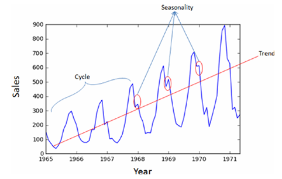

# Time Series

This repo is for my Time Series projects.

## Time Series Components

A time series can be made up of three key components.

- Trend: A long-term increase or decrease are termed trends.
- Seasonality: An effect of seasonal factors for a fixed or known period. For example, retail stores sales will be high during weekends and festival seasons.
- Cycle: These are the longer ups and downs that are not of fixed or known periods caused by external factors.

| Time Series components                 |
| -------------------------------------- |
|  |
