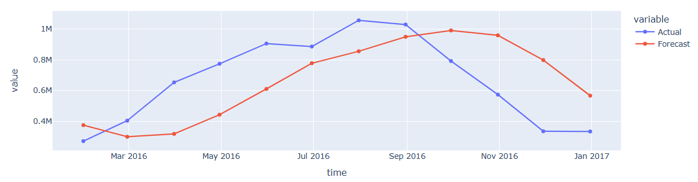
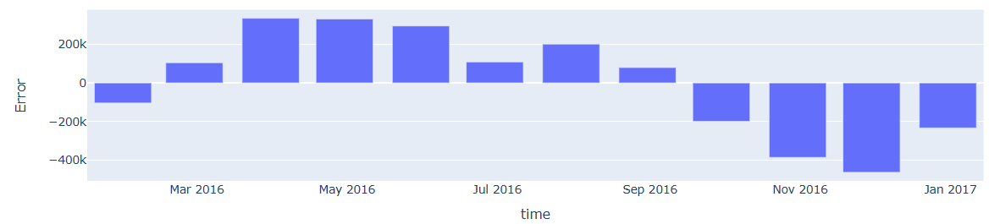
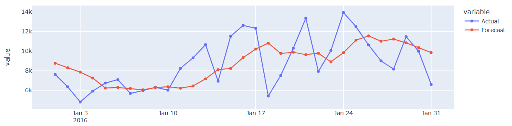
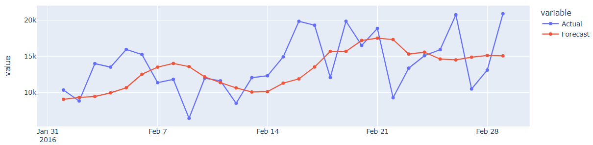

# Normal Time Series For Solar Energy

This project is focused on Time Series prediction to predict the amount of solar energy generated in a specific date.

## Screenshots

| 2016 Months Forecasts                            | 2016 Months Errors                          |
| ------------------------------------------------ | ------------------------------------------- |
|  |  |

| Jan 2016 Forecasts                | Feb 2016 Forecasts                |
| --------------------------------- | --------------------------------- |
|  |  |
