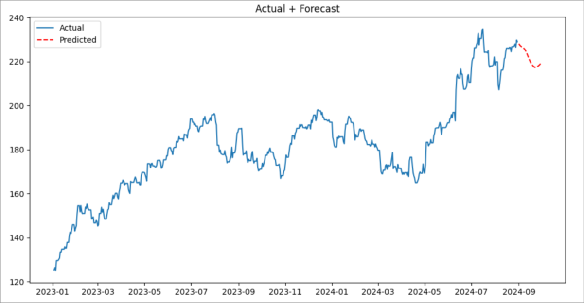
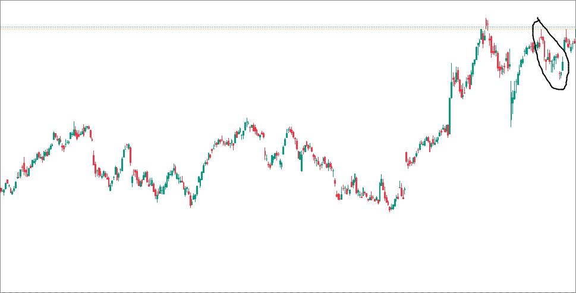

# Apple stock price prediction

In this project, i did normal time series analysis without any model.
 
By using the rolling average from `Jan, 2023 -> Aug, 2024`  to predict the stock price of Apple for `Sep, 2024`.

## Screen Shots

| Forecast                          |
| -------------------------------------------------- |
|  |

| Actual                          |
| -------------------------------------------------- |
|  |

